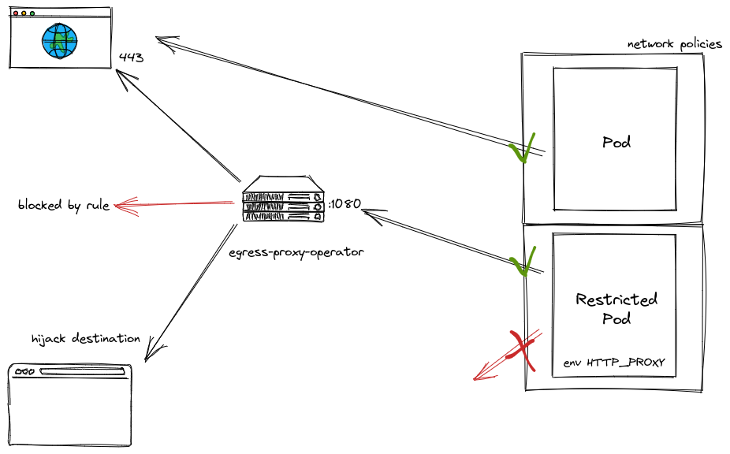

# egress-proxy-operator

Configure a proxy HTTP for cluster egress with CRD.

## Usage



## Examples

```yaml
apiVersion: egress-proxy.barpilot.io/v1alpha1
kind: Request
metadata:
  name: dont-want-to-work
spec:
  condition:
    destinations:
      - stackoverflow.com
  action:
    block: true
```

```yaml
apiVersion: egress-proxy.barpilot.io/v1alpha1
kind: Request
metadata:
  name: search-troll
spec:
  condition:
    destinations:
      - google.com
      - google.fr
  action:
    reroute: "https://www.qwant.com"
```

```yaml
apiVersion: egress-proxy.barpilot.io/v1alpha1
kind: Request
metadata:
  name: block-spaming
spec:
  condition:
    prefixes:
      - /wp-admin
  action:
    block: true
```
